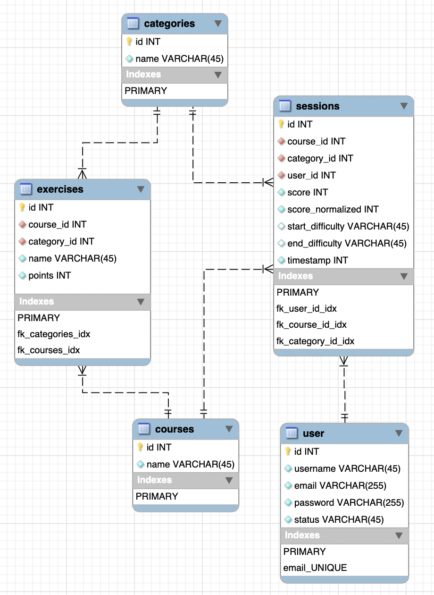

# Sample Courses

[](https://github.com/falmar/sample-courses/actions/workflows/deploy.yaml)

<div style="text-align: center;">
    
</div>

## Project Decisions and Implementation Notes

### DB

- Merged sessions and scores tables into a single table. according to the given schema it was an 1:1 table relation.

- Added category_id to sessions that should point to the latest category used by the user on that session.

- The exercises table felt ambiguous so was the lack of the context about if sessions should have been related to exercises or not, I would then have moved exercise id to the sessions table if it was the case. 

- The lack of data types make it to make decisions on the data. Assumed the difficult could have been a string enum 


### Code

- I created a single domain for the courses, created both a InMemory and PDO repository to test the applications. 
- There is a single CourseService with the responsibility to handle the business logic of the application. which is listing the last 12 most recent sessions and the option to output the latest 3 categories used by the user.
- Most are interfaces and their implementation so the code is portable and testable.


#### Running locally (Docker)

```bash
$ docker compose -f ./compose/local/compose.yaml up -d --build
$ docker exec -it sample-courses-php-1 sh
# inside the php container
$ cp .env.example .env
$ composer install
$ php artisan key:generate
$ php artisan migrate --seed
```

#### file structure of the domain

```text
Domains
└── Courses
    ├── Entities
    │   ├── Category.php
    │   └── Session.php
    ├── Enums
    │   └── ExerciseDifficultyEnum.php
    ├── Repos
    │   ├── CategoryRepositoryInterface.php
    │   ├── CategoryRepositoryMem.php
    │   ├── CategoryRepositoryPDO.php
    │   ├── SessionRepositoryInterface.php
    │   ├── SessionRepositoryMem.php
    │   └── SessionRepositoryPDO.php
    ├── SessionService.php
    ├── SessionServiceInterface.php
    ├── Specs
    │   ├── GetUserHistoryInput.php
    │   └── GetUserHistoryOutput.php
    └── ValueObjects
        └── SessionHistory.php
```
